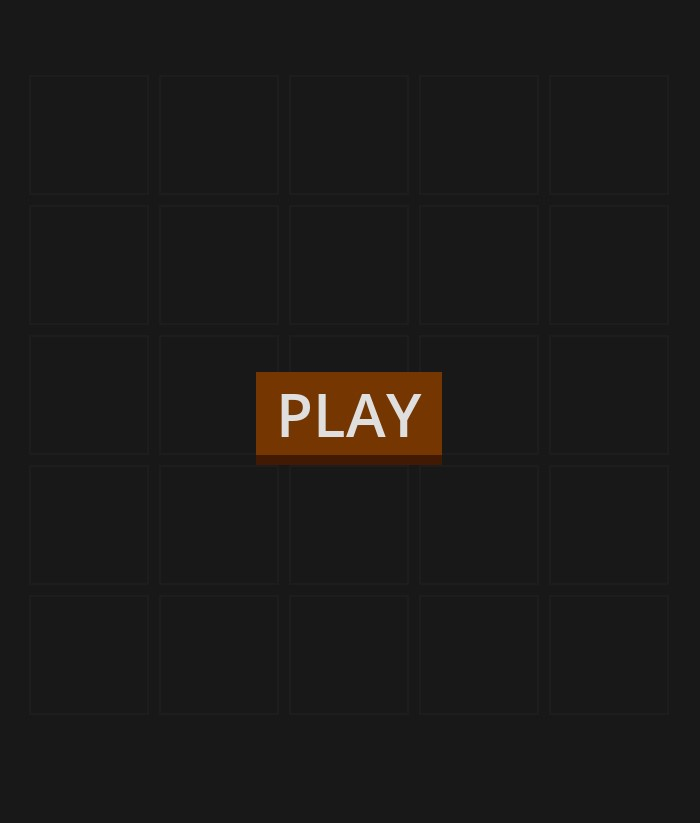
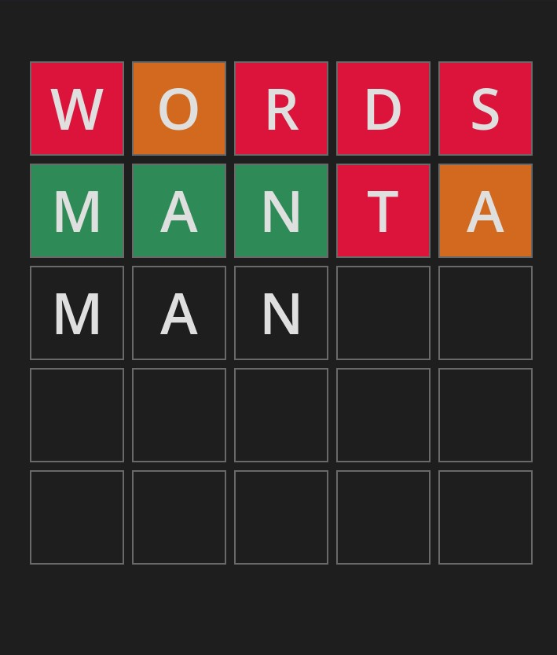

# Wordle Puzzle

This is a simple Wordle-like game built using Godot 4. The game allows players to guess a 5-letter word within a limited number of attempts (6). After each guess, the player is provided feedback indicating whether each letter is correct and in the correct position, correct but in the wrong position, or incorrect altogether.

